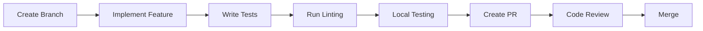
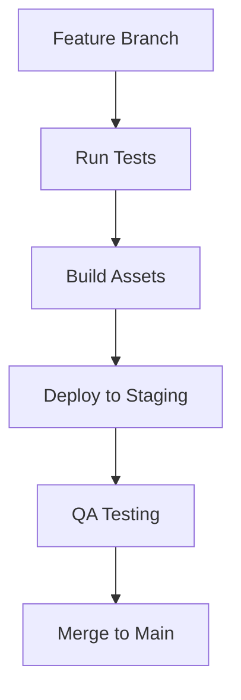
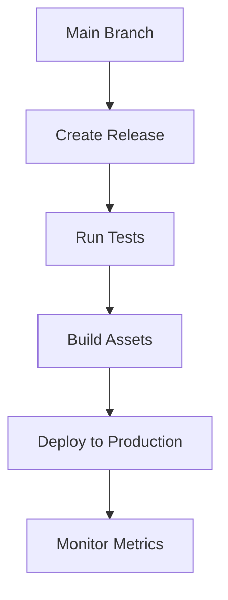

# Development Workflow Guide

*Last Updated: 2025-03-17*

## Development Environment Setup

### Prerequisites
1. Required Software:
   - Python 3.8+
   - Node.js 16+
   - Git
   - PostgreSQL (optional for development)
   - Redis (optional for development)
   - VS Code (recommended) or PyCharm

### Initial Setup Steps

1. **Clone Repository**
```bash
git clone <repository-url>
cd ChatSynth
```

2. **Backend Setup**
```bash
# Create virtual environment
python -m venv venv

# Activate virtual environment (Windows)
.\venv\Scripts\activate

# Install dependencies
pip install -r requirements.txt

# Set up environment variables
cp .env.example .env
```

3. **Frontend Setup**
```bash
cd frontend
npm install
```

## Development Process

### 1. Feature Development Workflow



#### Branch Naming Convention
- Feature: `feature/description`
- Bug Fix: `fix/description`
- Documentation: `docs/description`
- Refactor: `refactor/description`

### 2. Code Quality Standards

#### Python (Backend)
```python
# Example of well-structured code
from typing import Optional
from fastapi import HTTPException

class UserService:
    def __init__(self, db_session):
        self.db = db_session

    async def get_user(self, user_id: int) -> Optional[User]:
        """
        Retrieve user by ID.
        
        Args:
            user_id: The user's unique identifier
            
        Returns:
            User object if found, None otherwise
            
        Raises:
            HTTPException: If user not found
        """
        user = await self.db.query(User).filter(User.id == user_id).first()
        if not user:
            raise HTTPException(status_code=404, detail="User not found")
        return user
```

#### TypeScript (Frontend)
```typescript
// Example of well-structured component
interface ChatListProps {
  userId: number;
  onChatSelect: (chatId: number) => void;
}

export const ChatList: React.FC<ChatListProps> = ({ userId, onChatSelect }) => {
  const { data: chats, isLoading, error } = useQuery(['chats', userId], 
    () => fetchUserChats(userId)
  );

  if (isLoading) return <LoadingSpinner />;
  if (error) return <ErrorMessage error={error} />;

  return (
    <div className="chat-list">
      {chats.map(chat => (
        <ChatItem 
          key={chat.id}
          chat={chat}
          onClick={() => onChatSelect(chat.id)}
        />
      ))}
    </div>
  );
};
```

### 3. Testing Strategy

#### Backend Tests
```python
# Example test case
def test_create_user():
    user_data = {
        "email": "test@example.com",
        "password": "secure123"
    }
    response = client.post("/api/v1/users", json=user_data)
    assert response.status_code == 201
    assert response.json()["email"] == user_data["email"]
```

#### Frontend Tests
```typescript
// Example test case
describe('ChatList', () => {
  it('renders chat items correctly', () => {
    const mockChats = [
      { id: 1, title: 'Chat 1' },
      { id: 2, title: 'Chat 2' }
    ];
    
    const { getAllByRole } = render(<ChatList chats={mockChats} />);
    const chatItems = getAllByRole('listitem');
    
    expect(chatItems).toHaveLength(2);
  });
});
```

### 4. Code Review Process

#### Reviewer Checklist
1. Code Quality
   - [ ] Follows coding standards
   - [ ] Proper error handling
   - [ ] Efficient database queries
   - [ ] Type safety (TypeScript/Python)

2. Testing
   - [ ] Unit tests present
   - [ ] Integration tests if needed
   - [ ] Test coverage adequate

3. Documentation
   - [ ] Code comments where needed
   - [ ] API documentation updated
   - [ ] README updates if needed

### 5. Deployment Process

#### Staging Deployment


#### Production Deployment


## Development Tools

### 1. VS Code Extensions
- Python
- ESLint
- Prettier
- GitLens
- Python Test Explorer

### 2. Chrome Extensions
- React Developer Tools
- Redux DevTools
- Swagger Inspector

### 3. CLI Tools
```bash
# Backend development
uvicorn backend.app.main:app --reload

# Frontend development
npm run dev

# Database migrations
alembic upgrade head

# Run tests
pytest backend/tests
npm test
```

## Troubleshooting Guide

### 1. Common Backend Issues

#### Database Connection Issues
```python
# Check database connection
try:
    db.execute("SELECT 1")
except Exception as e:
    print(f"Database connection failed: {e}")
```

#### API Error Handling
```python
@app.exception_handler(HTTPException)
async def http_exception_handler(request, exc):
    return JSONResponse(
        status_code=exc.status_code,
        content={"detail": exc.detail}
    )
```

### 2. Common Frontend Issues

#### State Management
```typescript
// Debug Redux state
const Debug: React.FC = () => {
  const state = useSelector((state: RootState) => state);
  console.log('Current state:', state);
  return null;
};
```

#### API Integration
```typescript
// API error handling
api.interceptors.response.use(
  response => response,
  error => {
    if (error.response?.status === 401) {
      store.dispatch(logout());
    }
    return Promise.reject(error);
  }
);
```

## Best Practices

### 1. Code Organization
- Keep components small and focused
- Use proper file naming conventions
- Organize imports consistently
- Follow the Single Responsibility Principle

### 2. Performance
- Implement proper caching strategies
- Optimize database queries
- Use lazy loading where appropriate
- Monitor and optimize bundle size

### 3. Security
- Validate all inputs
- Implement proper authentication
- Use HTTPS everywhere
- Follow security best practices

## Next Steps
1. Review the [Technical Debt](./08_technical_debt.md) document
2. Set up your development environment
3. Start working on your first feature
