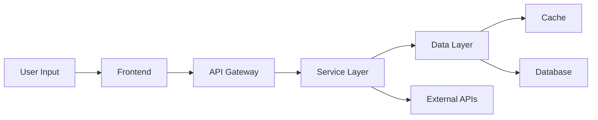

# ChatSynth Technical Guide

## Overview

ChatSynth is built as a modern, scalable application that aggregates and synthesizes conversations across multiple AI and social platforms. This technical guide explains the architecture, implementation details, and best practices for developers.

## 1. Architecture Overview

### 1.1 System Architecture

```
+----------------+        +----------------+        +----------------+
|   Frontend     |        |    Backend    |        |   Database    |
| (React/Next.js)|  <-->  |   (FastAPI)   |  <-->  |  (PostgreSQL) |
+----------------+        +----------------+        +----------------+
        ↑                        ↑                        ↑
        |                        |                        |
+----------------+        +----------------+        +----------------+
|  State (Redux) |        |    Services   |        |    Models     |
+----------------+        +----------------+        +----------------+
```

Key Components:
1. **Frontend Layer**
   - React/Next.js for UI
   - Redux for state management
   - TailwindCSS for styling
   - HeadlessUI for components

2. **Backend Layer**
   - FastAPI for REST endpoints
   - WebSocket for real-time
   - Celery for tasks
   - Redis for caching

3. **Database Layer**
   - PostgreSQL for storage
   - Redis for caching
   - S3 for media
   - ElasticSearch for search

### 1.2 Data Flow



## 2. Core Components

### 2.1 Universal Import System

The import system handles diverse content types through a plugin architecture:

```typescript
// Plugin Interface
interface ImportPlugin {
    name: string;
    supports: string[];
    validate(content: any): Promise<boolean>;
    process(content: any): Promise<ProcessedContent>;
}

// Plugin Registry
class PluginRegistry {
    private plugins: Map<string, ImportPlugin>;

    register(plugin: ImportPlugin): void {
        this.plugins.set(plugin.name, plugin);
    }

    async process(content: any): Promise<ProcessedContent> {
        const plugin = this.findPlugin(content);
        if (!plugin) {
            throw new Error('No suitable plugin found');
        }
        return plugin.process(content);
    }
}
```

### 2.2 Chat Processing Engine

The chat engine handles message processing and context management:

```typescript
// Message Processor
class MessageProcessor {
    async process(message: RawMessage): Promise<ProcessedMessage> {
        // 1. Content Normalization
        const normalized = await this.normalize(message);

        // 2. Context Extraction
        const context = await this.extractContext(normalized);

        // 3. Entity Recognition
        const entities = await this.detectEntities(normalized);

        // 4. Reference Resolution
        const references = await this.resolveReferences(normalized, context);

        return {
            ...normalized,
            context,
            entities,
            references
        };
    }
}

// Context Manager
class ContextManager {
    private contexts: Map<string, Context>;

    async trackContext(messageId: string, context: Context): Promise<void> {
        // Store context
        this.contexts.set(messageId, context);

        // Update relationships
        await this.updateRelationships(messageId, context);

        // Prune old contexts
        await this.pruneContexts();
    }
}
```

## 3. Implementation Details

### 3.1 Database Schema

The database is designed for flexibility and performance:

```sql
-- Core Tables
CREATE TABLE conversations (
    id UUID PRIMARY KEY,
    title VARCHAR(255),
    type VARCHAR(50),
    metadata JSONB,
    created_at TIMESTAMP,
    updated_at TIMESTAMP
);

CREATE TABLE messages (
    id UUID PRIMARY KEY,
    conversation_id UUID REFERENCES conversations(id),
    content JSONB,
    metadata JSONB,
    created_at TIMESTAMP,
    sequence_number INTEGER,
    UNIQUE (conversation_id, sequence_number)
);

-- Context and References
CREATE TABLE contexts (
    id UUID PRIMARY KEY,
    message_id UUID REFERENCES messages(id),
    type VARCHAR(50),
    data JSONB,
    confidence FLOAT
);

CREATE TABLE references (
    id UUID PRIMARY KEY,
    source_id UUID REFERENCES messages(id),
    target_id UUID REFERENCES messages(id),
    type VARCHAR(50),
    metadata JSONB
);
```

### 3.2 API Design

RESTful API endpoints follow a consistent pattern:

```typescript
// API Routes
interface APIRoutes {
    // Conversations
    'GET /conversations': {
        query: {
            page?: number;
            limit?: number;
            type?: string;
        };
        response: PaginatedResponse<Conversation>;
    };

    'POST /conversations': {
        body: {
            title: string;
            type: string;
            metadata?: Record<string, any>;
        };
        response: Conversation;
    };

    // Messages
    'GET /conversations/:id/messages': {
        params: {
            id: string;
        };
        query: {
            page?: number;
            limit?: number;
        };
        response: PaginatedResponse<Message>;
    };

    // Import
    'POST /import': {
        body: {
            type: string;
            content: any;
            options?: ImportOptions;
        };
        response: ImportResult;
    };
}
```

### 3.3 State Management

Frontend state management using Redux:

```typescript
// State Interface
interface AppState {
    conversations: {
        items: Conversation[];
        loading: boolean;
        error: Error | null;
    };
    messages: {
        byId: Record<string, Message[]>;
        loading: boolean;
        error: Error | null;
    };
    import: {
        status: 'idle' | 'importing' | 'success' | 'error';
        progress: number;
        error: Error | null;
    };
}

// Actions
const conversationSlice = createSlice({
    name: 'conversations',
    initialState,
    reducers: {
        fetchStart(state) {
            state.loading = true;
        },
        fetchSuccess(state, action) {
            state.items = action.payload;
            state.loading = false;
        },
        fetchError(state, action) {
            state.error = action.payload;
            state.loading = false;
        }
    }
});
```

## 4. Performance Optimization

### 4.1 Caching Strategy

Multi-level caching implementation:

```typescript
// Cache Interface
interface CacheProvider {
    get<T>(key: string): Promise<T | null>;
    set<T>(key: string, value: T, ttl?: number): Promise<void>;
    delete(key: string): Promise<void>;
}

// Cache Manager
class CacheManager {
    private providers: {
        memory: CacheProvider;
        redis: CacheProvider;
        disk: CacheProvider;
    };

    async get<T>(key: string): Promise<T | null> {
        // Try memory cache
        let value = await this.providers.memory.get<T>(key);
        if (value) return value;

        // Try Redis cache
        value = await this.providers.redis.get<T>(key);
        if (value) {
            await this.providers.memory.set(key, value);
            return value;
        }

        // Try disk cache
        value = await this.providers.disk.get<T>(key);
        if (value) {
            await this.providers.redis.set(key, value);
            await this.providers.memory.set(key, value);
            return value;
        }

        return null;
    }
}
```

### 4.2 Query Optimization

Database query optimization techniques:

```typescript
// Query Builder
class QueryBuilder {
    private query: QueryConfig;

    // Add indexes for common queries
    private indexes = {
        conversation: [
            'created_at',
            'type',
            'user_id'
        ],
        message: [
            'conversation_id',
            'created_at',
            'sequence_number'
        ]
    };

    // Optimize query based on indexes
    optimize(): QueryConfig {
        const optimized = {...this.query};

        // Check for index usage
        this.checkIndexUsage(optimized);

        // Add query hints
        this.addQueryHints(optimized);

        return optimized;
    }
}
```

## 5. Security Implementation

### 5.1 Authentication

JWT-based authentication system:

```typescript
// Auth Service
class AuthService {
    private readonly secret: string;
    private readonly algorithm: string;

    async createToken(user: User): Promise<string> {
        const payload = {
            id: user.id,
            roles: user.roles,
            exp: Date.now() + TOKEN_EXPIRY
        };

        return jwt.sign(payload, this.secret, {
            algorithm: this.algorithm
        });
    }

    async verifyToken(token: string): Promise<TokenPayload> {
        try {
            const payload = jwt.verify(token, this.secret);
            return payload as TokenPayload;
        } catch (error) {
            throw new AuthError('Invalid token');
        }
    }
}
```

### 5.2 Data Protection

Encryption and data protection:

```typescript
// Encryption Service
class EncryptionService {
    private readonly key: Buffer;
    private readonly algorithm: string;

    async encrypt(data: any): Promise<EncryptedData> {
        const iv = crypto.randomBytes(16);
        const cipher = crypto.createCipheriv(
            this.algorithm,
            this.key,
            iv
        );

        let encrypted = cipher.update(
            JSON.stringify(data),
            'utf8',
            'hex'
        );
        encrypted += cipher.final('hex');

        return {
            data: encrypted,
            iv: iv.toString('hex')
        };
    }
}
```

## 6. Testing Strategy

### 6.1 Test Structure

Comprehensive testing approach:

```typescript
// Test Categories
interface TestSuite {
    unit: {
        services: TestCase[];
        models: TestCase[];
        utils: TestCase[];
    };
    integration: {
        api: TestCase[];
        database: TestCase[];
        cache: TestCase[];
    };
    e2e: {
        flows: TestCase[];
        performance: TestCase[];
    };
}

// Test Case
interface TestCase {
    name: string;
    setup(): Promise<void>;
    execute(): Promise<void>;
    cleanup(): Promise<void>;
    assertions: Assertion[];
}
```

### 6.2 Mocking System

Flexible mocking system:

```typescript
// Mock Factory
class MockFactory {
    private mocks: Map<string, Mock>;

    createMock<T>(type: string): Mock<T> {
        const mock = new Mock<T>();
        this.mocks.set(type, mock);
        return mock;
    }

    async cleanup(): Promise<void> {
        for (const mock of this.mocks.values()) {
            await mock.reset();
        }
        this.mocks.clear();
    }
}
```

## 7. Deployment

### 7.1 Container Configuration

Docker configuration:

```dockerfile
# Development
FROM node:16 AS frontend
WORKDIR /app
COPY package*.json ./
RUN npm install
COPY . .
RUN npm run build

FROM python:3.9 AS backend
WORKDIR /app
COPY requirements.txt .
RUN pip install -r requirements.txt
COPY . .

# Production
FROM node:16-alpine AS frontend-prod
WORKDIR /app
COPY --from=frontend /app/build ./build
RUN npm install --production

FROM python:3.9-alpine AS backend-prod
WORKDIR /app
COPY --from=backend /app/dist ./dist
RUN pip install --no-cache-dir -r requirements.txt
```

### 7.2 Monitoring

Monitoring setup:

```typescript
// Metrics Collector
class MetricsCollector {
    private metrics: Map<string, Metric>;

    track(name: string, value: number, tags?: Record<string, string>): void {
        const metric = this.getOrCreateMetric(name);
        metric.record(value, tags);
    }

    async flush(): Promise<void> {
        for (const metric of this.metrics.values()) {
            await this.send(metric);
        }
    }
}
```

## 8. Error Handling

### 8.1 Error Types

Structured error handling:

```typescript
// Base Error
class AppError extends Error {
    constructor(
        message: string,
        public code: string,
        public status: number,
        public details?: any
    ) {
        super(message);
        this.name = this.constructor.name;
    }

    toJSON(): object {
        return {
            code: this.code,
            message: this.message,
            status: this.status,
            details: this.details
        };
    }
}

// Specific Errors
class ValidationError extends AppError {
    constructor(message: string, details?: any) {
        super(message, 'VALIDATION_ERROR', 400, details);
    }
}

class AuthenticationError extends AppError {
    constructor(message: string) {
        super(message, 'AUTH_ERROR', 401);
    }
}
```

### 8.2 Error Recovery

Error recovery strategies:

```typescript
// Recovery Manager
class RecoveryManager {
    private strategies: Map<string, RecoveryStrategy>;

    async recover(error: AppError): Promise<void> {
        const strategy = this.getStrategy(error);
        if (!strategy) {
            throw error;
        }

        try {
            await strategy.execute(error);
        } catch (recoveryError) {
            await this.handleRecoveryFailure(error, recoveryError);
        }
    }
}
```

## 9. Documentation

### 9.1 API Documentation

OpenAPI specification:

```yaml
openapi: 3.0.0
info:
  title: ChatSynth API
  version: 1.0.0
paths:
  /conversations:
    get:
      summary: List conversations
      parameters:
        - name: page
          in: query
          schema:
            type: integer
        - name: limit
          in: query
          schema:
            type: integer
      responses:
        200:
          description: Success
          content:
            application/json:
              schema:
                $ref: '#/components/schemas/ConversationList'
```

### 9.2 Code Documentation

Code documentation standards:

```typescript
/**
 * Processes a message and extracts relevant information
 * @param message - Raw message to process
 * @returns Processed message with metadata
 * @throws {ValidationError} If message format is invalid
 * @throws {ProcessingError} If processing fails
 */
async function processMessage(
    message: RawMessage
): Promise<ProcessedMessage> {
    // Implementation
}
```

## 10. Best Practices

### 10.1 Code Organization

Project structure:

```
src/
├── api/              # API routes
├── components/       # React components
├── services/         # Business logic
├── models/          # Data models
├── utils/           # Utilities
├── config/          # Configuration
├── types/           # TypeScript types
└── tests/           # Test files
```

### 10.2 Coding Standards

TypeScript configuration:

```json
{
    "compilerOptions": {
        "target": "es2020",
        "module": "esnext",
        "strict": true,
        "esModuleInterop": true,
        "skipLibCheck": true,
        "forceConsistentCasingInFileNames": true,
        "moduleResolution": "node",
        "resolveJsonModule": true,
        "isolatedModules": true,
        "noEmit": true,
        "jsx": "react-jsx"
    }
}
```
