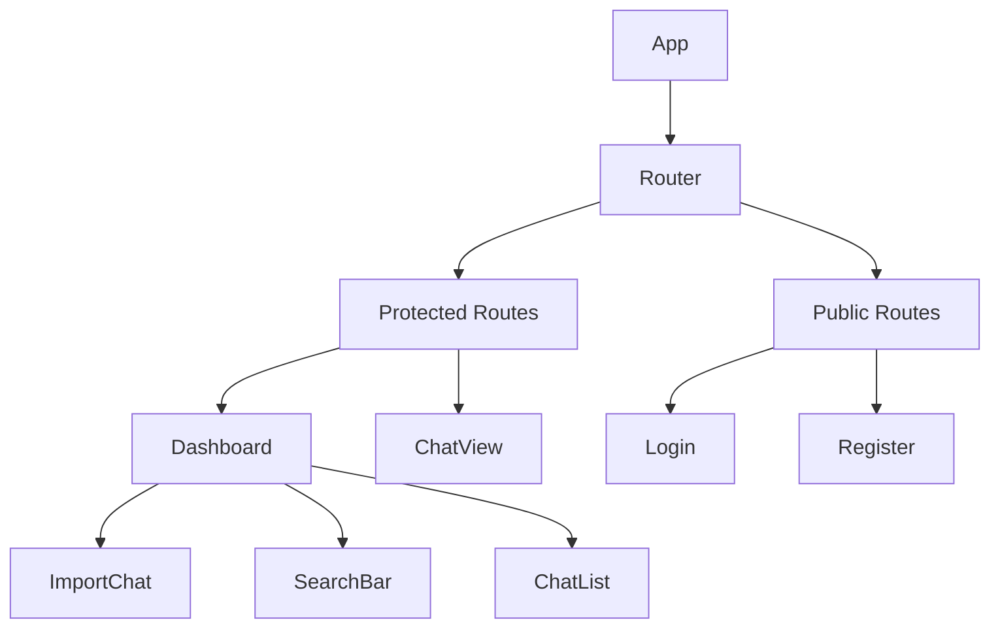
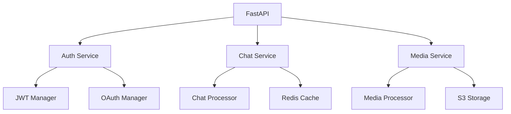
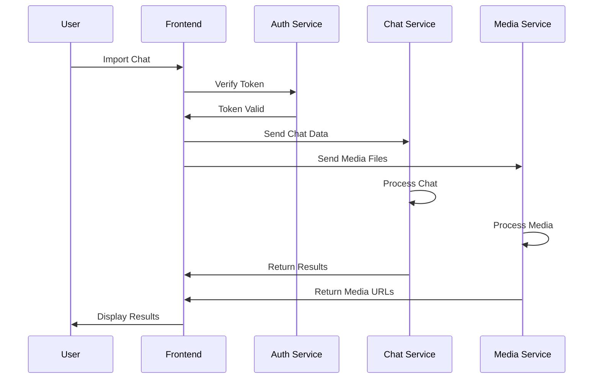

# VoxStitch Architecture

## Overview

VoxStitch is built using a modern, scalable architecture that combines a React frontend with a FastAPI backend. The system is designed to efficiently process and analyze chat data from multiple platforms.

## System Components

### 1. Frontend Architecture



#### Key Components
- **App**: Main application container
- **Router**: Handles navigation and route protection
- **Protected Routes**: Requires authentication
- **Public Routes**: Accessible without authentication
- **Dashboard**: Main user interface
- **ChatView**: Detailed chat display
- **ImportChat**: Chat import dialog
- **SearchBar**: Advanced search interface
- **ChatList**: Chat display and management

### 2. Backend Architecture



#### Key Services
- **Auth Service**: Handles authentication and authorization
- **Chat Service**: Manages chat data and processing
- **Media Service**: Handles media file processing
- **JWT Manager**: Manages user sessions
- **OAuth Manager**: Handles social authentication
- **Chat Processor**: Analyzes chat content
- **Media Processor**: Processes audio/video/images
- **Redis Cache**: Caches processed data
- **S3 Storage**: Stores media files

### 3. Data Flow



## Technology Stack

### Frontend
- React 18
- TypeScript
- TailwindCSS
- Zustand (State Management)
- React Router
- Axios

### Backend
- FastAPI
- Python 3.9+
- OpenAI GPT-4
- Whisper API
- Redis
- PostgreSQL
- AWS S3

## Security

1. **Authentication**
   - JWT-based authentication
   - Social login (Google, GitHub, Apple)
   - Rate limiting
   - CSRF protection

2. **Authorization**
   - Role-based access control
   - Guest user limitations
   - API endpoint protection

3. **Data Security**
   - Encrypted data storage
   - Secure file uploads
   - HTTPS-only communication

## Scalability

1. **Horizontal Scaling**
   - Stateless backend services
   - Redis for session management
   - Load balancer ready

2. **Performance Optimization**
   - Response caching
   - Lazy loading
   - Efficient database queries

3. **Resource Management**
   - Media file optimization
   - Background processing
   - Queue management

## Development Workflow

1. **Code Organization**
   ```
   /frontend
     /src
       /components
       /pages
       /store
       /utils
   /backend
     /app
       /core
       /api
       /models
   ```

2. **Testing Strategy**
   - Unit tests
   - Integration tests
   - E2E tests
   - Performance testing

3. **Deployment Pipeline**
   - CI/CD integration
   - Automated testing
   - Staging environment
   - Production deployment
