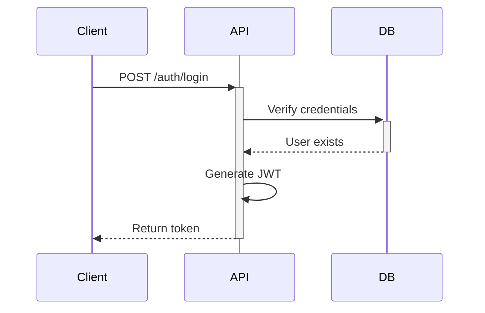
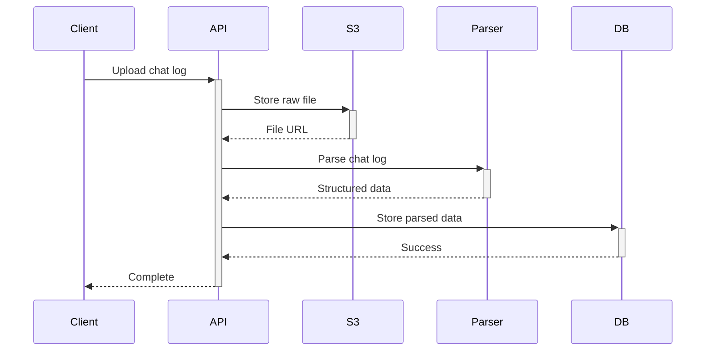
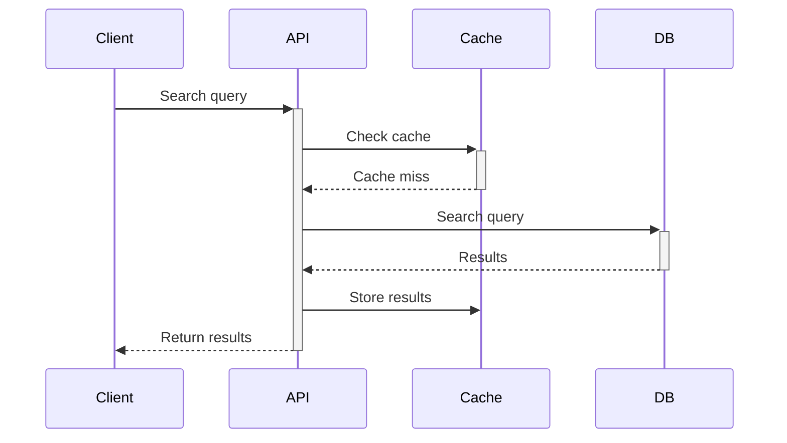

# Architecture Guide

*Last Updated: 2025-03-17*

## System Architecture Overview

### High-Level Architecture
```
[Client Browser] ←→ [Frontend (React)] ←→ [Backend API (FastAPI)] ←→ [Database (PostgreSQL)]
                                                  ↕
                                          [Cache (Redis)]
                                                  ↕
                                        [Storage (AWS S3)]
```

## Component Breakdown

### 1. Frontend Architecture (React)
```
frontend/
├── src/
│   ├── components/           # React components
│   │   ├── auth/            # Authentication components
│   │   ├── chat/            # Chat interface components
│   │   ├── common/          # Reusable UI components
│   │   └── layout/          # Layout components
│   ├── hooks/               # Custom React hooks
│   ├── services/            # API integration
│   ├── store/               # Redux state management
│   └── utils/               # Helper functions
```

#### Key Design Patterns
1. **Component Architecture**
   - Functional components with hooks
   - Container/Presenter pattern
   - Higher-order components for shared functionality

2. **State Management**
   ```typescript
   // Example Redux slice
   export const chatSlice = createSlice({
     name: 'chat',
     initialState,
     reducers: {
       setChatLogs: (state, action) => {
         state.logs = action.payload;
       }
     }
   });
   ```

### 2. Backend Architecture (FastAPI)
```
backend/
├── app/
│   ├── api/                 # API endpoints
│   │   ├── auth.py         # Authentication routes
│   │   ├── chat.py         # Chat management routes
│   │   └── users.py        # User management routes
│   ├── core/               # Core functionality
│   │   ├── config.py       # Configuration
│   │   ├── security.py     # Security utilities
│   │   └── database.py     # Database connection
│   ├── models/             # Database models
│   └── utils/              # Helper functions
```

#### Key Design Patterns
1. **Dependency Injection**
   ```python
   def get_db():
       db = SessionLocal()
       try:
           yield db
       finally:
           db.close()
   ```

2. **Repository Pattern**
   ```python
   class ChatRepository:
       def __init__(self, db: Session):
           self.db = db
           
       async def get_chats(self, user_id: int):
           return self.db.query(Chat).filter(Chat.user_id == user_id).all()
   ```

### 3. Database Architecture

#### Schema Design
```sql
-- Core Tables
CREATE TABLE users (
    id SERIAL PRIMARY KEY,
    email VARCHAR(255) UNIQUE NOT NULL,
    hashed_password VARCHAR(255) NOT NULL
);

CREATE TABLE chat_logs (
    id SERIAL PRIMARY KEY,
    user_id INTEGER REFERENCES users(id),
    content JSONB,
    created_at TIMESTAMP DEFAULT CURRENT_TIMESTAMP
);
```

#### Indexing Strategy
```sql
-- Performance Indexes
CREATE INDEX idx_chat_logs_user_id ON chat_logs(user_id);
CREATE INDEX idx_chat_logs_created_at ON chat_logs(created_at);
```

### 4. Authentication Flow



## Data Flow Examples

### 1. Chat Log Import


### 2. Search Operation


## Security Architecture

### 1. Authentication
- JWT-based token system
- Refresh token rotation
- Rate limiting on auth endpoints

### 2. Data Protection
```python
# Example security middleware
@app.middleware("http")
async def add_security_headers(request, call_next):
    response = await call_next(request)
    response.headers["X-Frame-Options"] = "DENY"
    response.headers["X-Content-Type-Options"] = "nosniff"
    return response
```

### 3. API Security
- Input validation using Pydantic
- CORS configuration
- Request rate limiting

## Monitoring & Logging

### 1. Application Logs
```python
# Example logging configuration
logger = logging.getLogger(__name__)
logger.setLevel(logging.INFO)
```

### 2. Performance Metrics
- Request duration
- Database query times
- Cache hit rates

## Deployment Architecture

### 1. Development
```
[Local Machine]
  ├── Frontend Dev Server (3000)
  ├── Backend Dev Server (8000)
  ├── PostgreSQL
  └── Redis
```

### 2. Production
```
[Cloud Provider]
  ├── Frontend (Vercel)
  ├── Backend (Railway)
  ├── Database (Railway PostgreSQL)
  └── Cache (Railway Redis)
```

## Technical Considerations

### 1. Scalability
- Horizontal scaling of API servers
- Database connection pooling
- Caching strategy

### 2. Performance
- Optimized database queries
- Frontend bundle optimization
- API response compression

### 3. Maintainability
- Consistent coding standards
- Comprehensive documentation
- Automated testing

## Next Steps
1. Review the [Database Guide](./04_database_guide.md)
2. Understand the [API Documentation](./05_api_documentation.md)
3. Set up your local development environment
